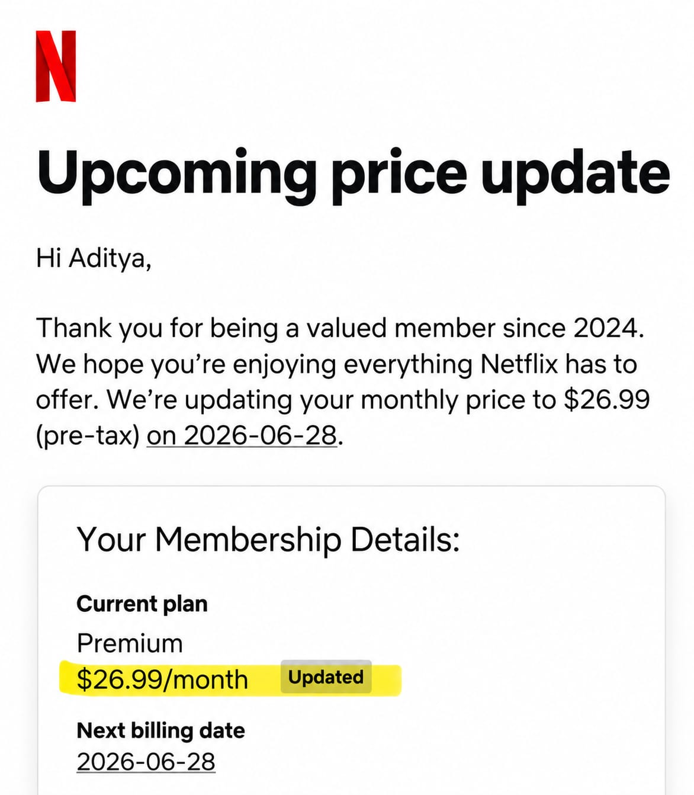
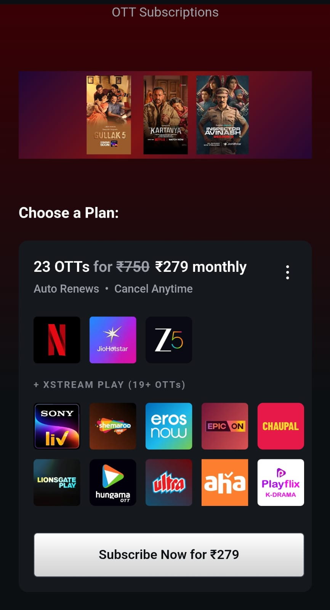
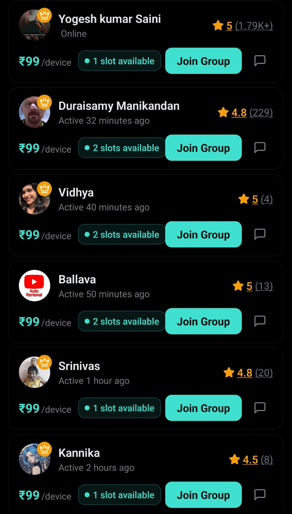
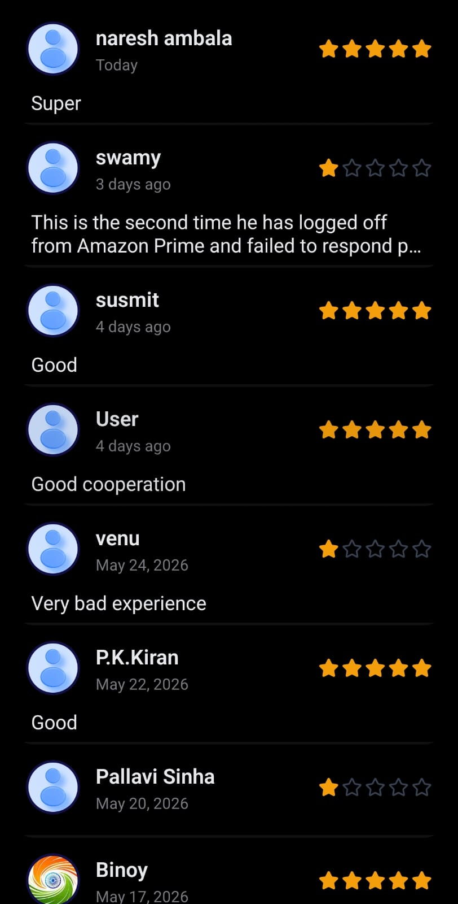

# Subspace Product Teardown

Prepared as part of a Product Intern Assignment.

All observations are based on hands 
on testing of the product.
## Proposed Product Improvements

# 1. Fake Subscription Listings Can Be Created Too Easily

### Evidence

### Observed

I was able to create a Netflix subscription listing using screenshot-based verification.

### Problem

The current verification flow validates the presence of proof but not necessarily the authenticity of the subscription.

This creates the possibility of fake or manipulated subscription listings being uploaded to the marketplace.

### Ship Instead

- OCR-based verification
- Ownership verification
- Random proof challenges
- New seller review period
- Fraud risk scoring

### Expected Impact

- Lower fraud rate
- Higher buyer confidence
- Reduced refund requests

---

# 2. Expand Payment Hold / Escrow System

### Observed

Subspace already uses a payment hold mechanism to reduce fraud.

This is one of the strongest trust features in the product.

### Problem

Disputes and seller-side fraud can still create losses for both buyers and the platform.

### Ship Instead

Buyer Pays → Payment Held → Access Confirmed → Release Funds

Additional improvements:

- Buyer confirmation before fund release
- Dispute resolution window
- Seller reliability score
- Automatic escrow workflow

### Expected Impact

- Reduced refund losses
- Better trust
- Lower platform liability

---

# 3. Subscription Bundles Instead of Individual Discovery

### Current Experience

### Proposed Experience

### Problem

Users currently evaluate subscriptions individually.

This increases decision fatigue and reduces the likelihood of purchasing multiple subscriptions together.

### Ship Instead

Create curated bundles:

- Entertainment Bundle
- Student Bundle
- Creator Bundle

Example:

Netflix + Prime + SonyLiv bundled into one monthly package.

### Expected Impact

- Higher Average Order Value (AOV)
- Better retention
- Simpler buying experience

---

# 4. Clear ICP Focus

### Observed

The platform currently serves multiple use cases:

- Subscription sharing
- Gift cards
- Expense tracking
- Bill splitting

### Problem

New users may struggle to understand the primary value proposition.

### Ship Instead

Focus onboarding around:

> Students and Young Professionals looking to reduce recurring subscription costs.

### Expected Impact

- Better conversion
- Easier positioning
- Stronger acquisition

---

# 5. Reputation System Needs More Signal

### Current Seller Discovery

### Current Reviews

### Problem

Most sellers have very similar ratings, making differentiation difficult.

Buyers currently rely mostly on review counts and star ratings.

### Ship Instead

Display:

- Trust Score
- Successful Transactions
- Success Rate
- Dispute Rate
- Member Since

Example:

Trust Score: 96/100

324 Successful Transactions

98% Success Rate

Member Since 2024

### Expected Impact

- Higher buyer confidence
- Better seller differentiation
- Stronger marketplace trust

---

# Final Recommendation

The strongest opportunity for Subspace is strengthening marketplace trust.

## Priority 1

- Stronger fake-listing prevention
- Expanded payment hold / escrow workflow

## Priority 2

- Subscription bundles
- Better seller reputation signals

These initiatives can improve buyer confidence while reducing fraud-related losses and helping Subspace scale sustainably.
